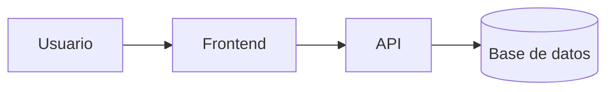

# Laboratorio README
 
Proyecto de práctica para aprender Markdown avanzado en GitHub.
 
## Descripción
 
Este repositorio documenta paso a paso mi aprendizaje de Markdown:
tablas, listas de tareas, badges y diagramas.

## Estado de funcionalidades

 
| Función | Estado |
| :--- | :--- |
| Login | Listo |
| Reporte | En proceso |

## Pendientes
 
- [x] Diseño de la base de datos
- [ ] Pruebas unitarias

## Arquitectura
 

